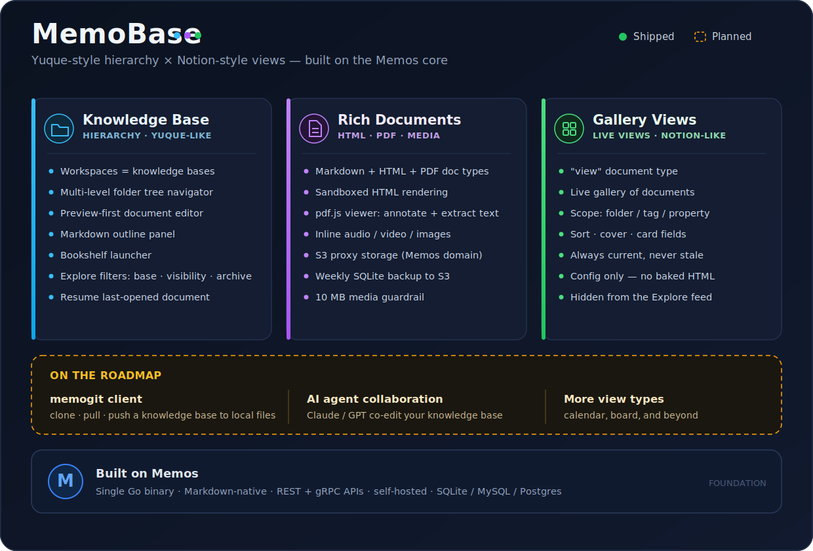
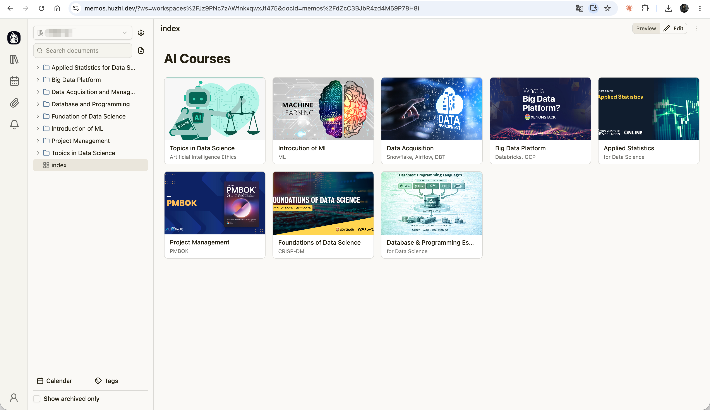

# MemoBase

> A hierarchical, view-powered knowledge base built on top of
> [**Memos**](https://github.com/usememos/memos).




This project is a fork of the excellent open-source
[usememos/memos](https://github.com/usememos/memos). Memos gives you a fast,
Markdown-native, self-hosted place to capture notes. **MemoBase keeps all of
that** and grows it into a structured knowledge base — think **Yuque's folder
hierarchy** combined with **Notion's views**, without either one's weight.

- **Yuque's strength:** a knowledge base with real, multi-level folder paths —
  the capacity to hold and organize a lot.
- **Notion's strength:** views that surface and connect the documents that
  matter, instead of leaving them buried in folders.
- **Memos' strength (kept intact):** a single Go binary, a lightweight one
  record = one document model, and full REST + gRPC APIs. No heavyweight
  per-page database.



---

## What this fork adds

### 📂 Hierarchical knowledge base (Yuque-like)

Every document lives in a **workspace** (knowledge base) under a
slash-separated **folder path**. The home page becomes a three-pane document
workspace: a folder tree as the primary navigator, a preview-first single
document view, and a Markdown outline. A **Bookshelf** arranges your knowledge
bases as books, and the reworked **Explore** page adds workspace / visibility /
archive filters. → [Manual](./docs/manual/01-knowledge-base.md)


### 📄 Render-only document types: HTML & PDF

Beyond Markdown, MemoBase treats **HTML** and **PDF** as first-class documents.
HTML renders in a sandboxed iframe (perfect for the self-contained HTML that AI
assistants love to produce). PDFs get a real **pdf.js viewer** with paging,
zoom, **annotations**, and **text extraction** — and render consistently in the
Notebook, the Explore list, and the shareable detail page. Attachment handling
is upgraded too: paste images/audio/video to inline them, with real playable
players in preview. → [Manual](./docs/manual/02-rich-documents.md)

### 🖼 Notion-style Gallery Views

A **View** document holds only configuration and renders a **live gallery** of
other documents — scoped by folder, tag, or property; sorted, covered, and
labeled however you choose. It always reflects current data, never a stale
snapshot. This is how you connect the core documents out of a large hierarchy.
→ [Manual](./docs/manual/03-gallery-views.md)

## 📖 Documentation

The [**User Manual**](./docs/manual/README.md) covers every added feature:

1. [Knowledge Base & Hierarchy](./docs/manual/01-knowledge-base.md)
2. [Rich Documents & Media](./docs/manual/02-rich-documents.md) (HTML, PDF, inline media, S3 storage & backup)
3. [Gallery Views](./docs/manual/03-gallery-views.md)
4. [Markdown Editor Optimization ](docs/manual/04-md-editor-optimization.md) (Notion / Obsidian–style formatting shortcuts)

Design and requirement docs for each feature live under [`docs/plans/`](./docs/plans/).

## Where this is going

The roadmap points at **AI-native collaboration**:

- **`memogit`** — a client that wraps the Memos API as familiar Git-style
  commands (`memogit clone` / `pull` / `push`), checking a knowledge base out to
  a local folder so AI clients (Claude, GPT, …) can collaborate on it as plain
  files.
- Deeper AI integrations built on the same stable REST/gRPC surface.

## Quick Start

### Docker

```bash
docker run -d \
  --name memos \
  -p 5230:5230 \
  -v ~/.memos:/var/opt/memos \
  neosmemo/memos:stable
```

Open `http://localhost:5230` and start writing.

> Note: the public `neosmemo/memos` image is upstream Memos. To run this fork,
> build the image from this repository (see the [`Dockerfile`](./Dockerfile) and
> [`deploy.sh`](./deploy.sh)).

### Development

```bash
go run ./cmd/memos --port 8081   # backend
pnpm dev                         # web (in ./web)
```

## Relationship to upstream Memos

MemoBase is a **respectful fork**, not a replacement. All credit for the
foundation — the capture UX, the Go backend, the storage layer, the API design —
belongs to the [Memos team and contributors](https://github.com/usememos/memos).
This fork tracks upstream and layers a knowledge-base product on top.

If you want the original, lightweight, timeline-first note-taking tool, use
upstream Memos:

- **Website** — <https://usememos.com>
- **Docs** — <https://usememos.com/docs>
- **Repository** — <https://github.com/usememos/memos>
- **License** — Memos is [MIT-licensed](LICENSE); this fork inherits the same license.

## License

Licensed under the [MIT License](LICENSE), inherited from upstream Memos.
